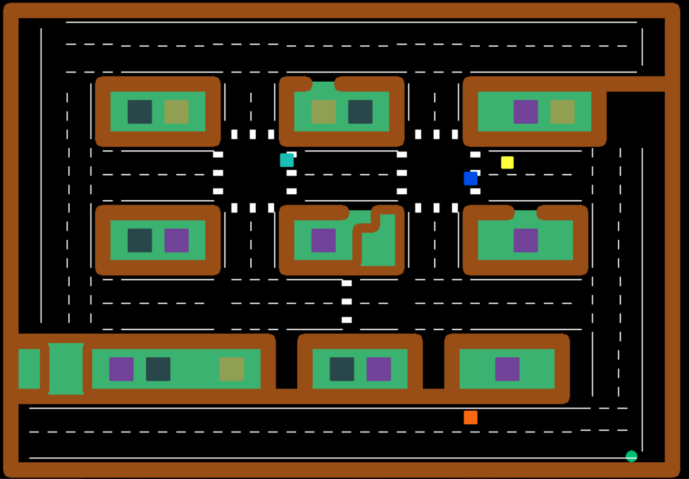

# Autonomous-Car

In order to build a driverless car, we need to start from scratch which are designing the agent(i.e. car) and the virtual environment.
The virtual environment consists of static as well as dynamic agents.
The brain of the agent is coded in such a way to fulfill two major objectives.
The Python(version 2.7) is used for coding.

**MDP**

- Markov Decision process is used to take decisions where outcomes are uncertain.
- In this algorithm agent’s main goal is to take that path through which it can maximize its output that is collect maximum rewards.
- Each state in our environment is assigned with a certain value which is calculated using RL.


**REINFORCEMENT LEARNING**

*Basic Idea:* 
- Receive feedback in the form of rewards
- Agent’s Utility is defined by the reward function
- Maximise the expected rewards
- Learning is based on observed samples of outcomes

**OUTPUT**

- The car [yellow square] is able to traverse the virtual environment, while avoiding the various obstacles [ other cars { blue and aqua coloured squares }, buildings, roads] in its path.
- The car generally chooses the fastest route to the destination.
- The car manages to obey certain basic rules such as keeping to the road.

    

----------------------
-----------------------

## Commands

```
cd src

python gridworld.py -m
python gridworld.py -h
python gridworld.py -g MazeGrid
python gridworld.py -a value -i 100 -k 10
python gridworld.py -a value -i 5
python gridworld.py -a value -i 100 -g BridgeGrid --discount 0.9 --noise 0.2
python gridworld.py -a value -i 100 -g DiscountGrid --discount 0.9 --noise 0.2 --livingReward 0.0
python gridworld.py -a q -k 5 -m
python gridworld.py -a q -k 100 
python gridworld.py -a q -k 50 -n 0 -g BridgeGrid -e 1
python crawler.py
python car.py -p CarQAgent -x 2000 -n 2010 -l smallGrid 
python car.py -p CarQAgent -n 10 -l smallGrid -a numTraining=10
python car.py -p ApproximateQAgent -x 2000 -n 2010 -l smallGrid 
python car.py -p ApproximateQAgent -a extractor=SimpleExtractor -x 50 -n 60 -l mediumGrid 
python car.py -p ApproximateQAgent -a extractor=SimpleExtractor -x 50 -n 60 -l mediumClassic 
python car.py -p ApproximateQAgent -a extractor=SimpleExtractor -x 50 -n 150 -l mediumGrid -q -f

python car.py -p KeyboardAgent -g DirectionalGhost -x 0 -n 60 -l demoGrid1 -k 0
python car.py -p KeyboardAgent -g DirectionalGhost -x 0 -n 60 -l demoGrid1 -k 1
python car.py -p ApproximateQAgent -a extractor=SimpleExtractor -x 0 -n 60 -l demoGrid1
python car.py -p ApproximateQAgent -a extractor=SimpleExtractor -x 0 -n 60 -l demoGrid2
python car.py -p ApproximateQAgent -a extractor=SimpleExtractor -x 50 -n 60 -l demoGrid2
python car.py -p ApproximateQAgent -g DirectionalGhost -a extractor=SimpleExtractor -x 0 -n 60 -l demoGrid3
```